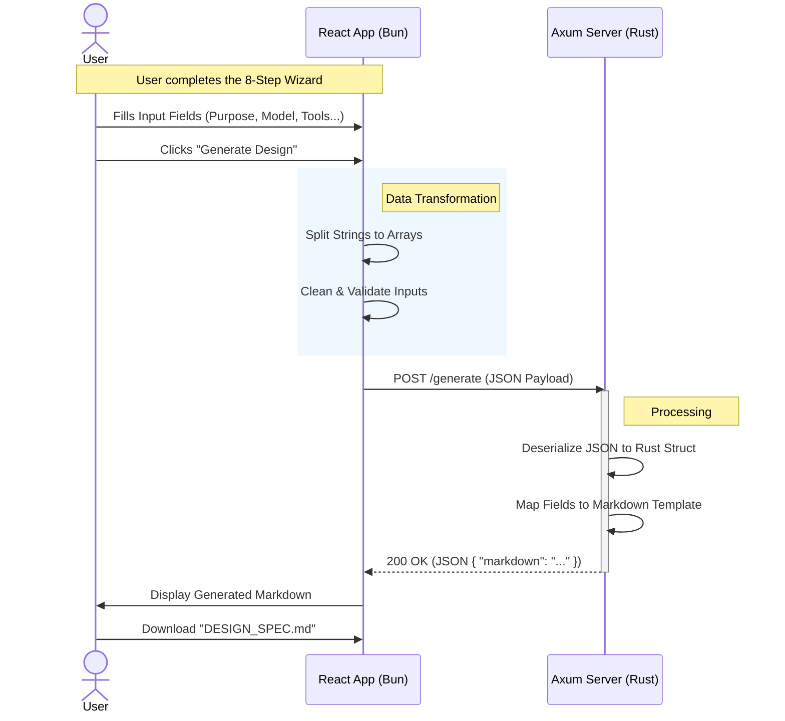

# Sequence Diagrams

**Audience**: Developers, Architects

## WHAT

This document illustrates the interaction flow for generating a System Design Document through sequence diagrams.

## WHY

Sequence diagrams provide:

1. **Visual clarity** - Understand message flow at a glance
2. **Integration insight** - See component boundaries
3. **Debugging aid** - Trace request/response paths

## HOW

### Design Generation Flow



### ASCII Representation

```
User          Frontend              Backend
 │               │                     │
 │──Fill Form───▶│                     │
 │               │                     │
 │──Generate────▶│                     │
 │               │──Transform Data────▶│
 │               │                     │
 │               │──POST /generate────▶│
 │               │                     │──Deserialize
 │               │                     │──Generate MD
 │               │◀──200 OK (JSON)─────│
 │               │                     │
 │◀──Display MD──│                     │
 │               │                     │
 │──Download────▶│                     │
 │               │                     │
```

### Request/Response Example

**Request:**
```json
{
  "purpose": {
    "use_case": "Customer support chatbot",
    "user_needs": ["24/7 availability", "FAQ handling"],
    "success_criteria": "90% resolution rate"
  },
  ...
}
```

**Response:**
```json
{
  "markdown": "# AI System Design Specification\n\n## 1. Purpose & Scope\n..."
}
```

## Related Documentation

- [Data Flow](data-flow.md) - Detailed data lifecycle
- [Architecture](architecture.md) - System structure
- [Integration](integration.md) - Web/Desktop modes
