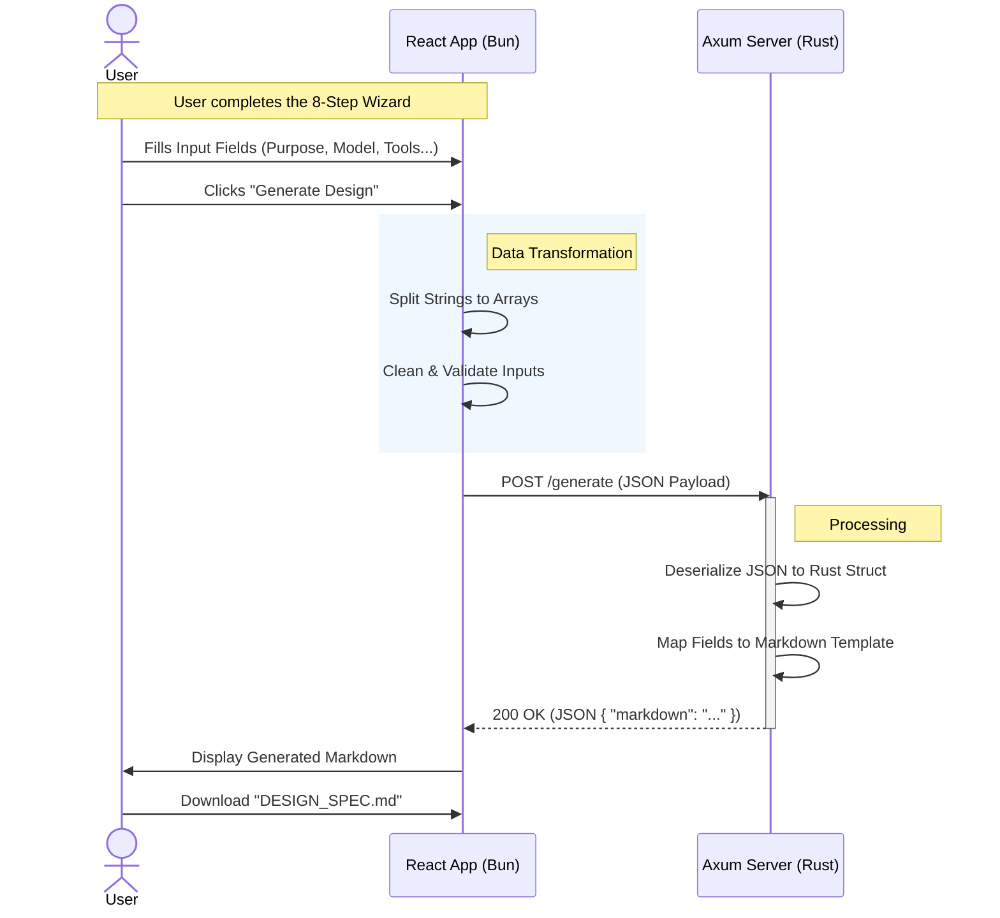

# Sequence Diagram

The following sequence diagram illustrates the interaction flow for generating a System Design Document.

```mermaid
sequenceDiagram
    actor User
    participant Frontend as React App (Bun)
    participant Backend as Axum Server (Rust)

    Note over User, Frontend: User completes the 8-Step Wizard

    User->>Frontend: Fills Input Fields (Purpose, Model, Tools...)
    User->>Frontend: Clicks "Generate Design"

    rect rgb(240, 248, 255)
        Note right of Frontend: Data Transformation
        Frontend->>Frontend: Split Strings to Arrays
        Frontend->>Frontend: Clean & Validate Inputs
    end

    Frontend->>Backend: POST /generate (JSON Payload)
    activate Backend

    Note right of Backend: Processing
    Backend->>Backend: Deserialize JSON to Rust Struct
    Backend->>Backend: Map Fields to Markdown Template

    Backend-->>Frontend: 200 OK (JSON { "markdown": "..." })
    deactivate Backend

    Frontend->>User: Display Generated Markdown
    User->>Frontend: Download "DESIGN_SPEC.md"
```
