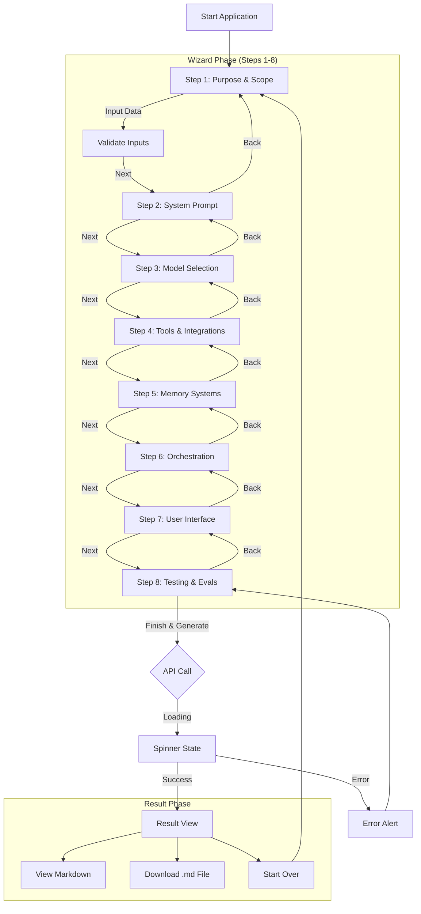

# User Interaction Flow

This document details the user's journey through the System Designer Agent interface.

## State Transitions

1.  **Initialization:** App loads, sets `currentStep = 0` (Purpose).
2.  **Navigation:** 
    - `Next`: Increments `currentStep` (if < 7).
    - `Back`: Decrements `currentStep` (if > 0).
    - Data is persisted in React state (`formData` object) across navigations.
3.  **Generation:**
    - Triggered on Step 8 "Finish".
    - Sets `loading = true`.
    - Disables buttons.
    - On response, sets `result = data.markdown` and `loading = false`.
4.  **Reset:**
    - `Start Over` clears `result` (but currently preserves `formData` for iteration).
